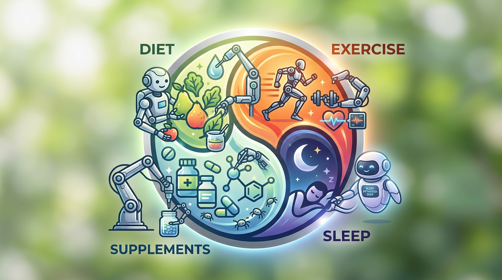

# 🧬 AI Health

  

## Get Healthy With Claude

Hollywood stars had live-in chefs. Elite athletes had full-time trainers five days a week. And they were *less* effective than what you're about to set up in 30 minutes.

AI just replaced the personal trainer, the nutritionist, and the meal prep chef — and it's better, because it does the math perfectly every single time. You bring the discipline and the routine. Claude handles everything else.

**This is not an app.** It's a Claude Project — a persistent AI workspace with your health plan baked into its instructions. You talk to it in plain English. It does the math.

### Why this works

Most plans make you eat from a fixed meal list. This one doesn't. You eat whatever you want — the solver tells you exactly how to hit your targets with your final meal. Had pizza for lunch? Fine. The math still closes. That flexibility is why people actually stick with it.

Total time cost: ~10 hours a week. Three hours training, a few hours cooking, a few minutes a day talking to Claude. That's it. No meal prep Sundays. No spreadsheet wrestling. No willpower-dependent decisions about what to eat — just data and a solver that does the algebra for you.

---

## What You're Signing Up For

- [ ] **Train 3x per week.** Same simple workout every time. Just show up.
- [ ] **Track your food daily.** Log every calorie — the AI doesn't judge. 2 minutes.
- [ ] **Sleep 7+ hours.** You can't out-train bad sleep.

That's it. ~10 hours a week, 6% of your waking life. If you read that and thought "yes" — let's go.

---

## What This System Does

**One-time (~30 min):** Claude interviews you — photos, stats, goals, constraints — and generates a personalized health plan with calorie/macro targets, a training program, and supplements. You paste it into a Claude Project.

**Every day (~60 sec):** Tell Claude what you ate. It tracks your macros and solves your final meal — exactly how many grams of each ingredient to hit your targets perfectly.

**That's the whole daily workflow.** List food → get numbers → solve final meal → eat.

---

## Installation

1. Go to [claude.ai/customize/skills](https://claude.ai/customize/skills)
2. Upload both `.skill` files from this repo:
   - [`health-strategy.skill`](health-strategy.skill) — one-time setup interview
   - [`daily-macros.skill`](daily-macros.skill) — daily macro tracker and meal solver
3. Create a new project at [claude.ai/projects](https://claude.ai/projects), then start a conversation and tell Claude: **"Use the health strategy skill"** — it will interview you and generate your personalized health plan
4. Paste the generated health plan into your project's instructions — now every conversation in that project knows your targets and the daily macros skill just works

---

## Setup Guide (Step by Step)

### What You Need

- A Claude account (free works, Pro is better — higher message limits)
- 30 minutes, photos of yourself (front + side), and your basic stats (age, sex, height, weight)

### Step 1: Run the Health Strategy Interview (One-Time)

Start a new [Claude project](https://claude.ai), open a conversation, and say **"Set up my health plan."** Claude interviews you and generates your personalized plan. Paste the output into your project's instructions. Done once.

### Step 2: Use Daily Macros as Your Daily Driver

This is the skill you'll use every day. Open a conversation in your project anytime you eat:

- **"Count my macros: [list what you ate]"**
- **"Solve my last meal"** (after counting, to figure out your final meal)
- **"Solve my last meal with chicken, rice, and almonds"** (if you want to specify ingredients)
- **"Ate: [food list]. Solve remaining with chicken, rice, almonds"** (count + solve in one shot)

Because your health plan is in the project instructions, every conversation already knows your calorie and macro targets. You just talk to it.

That's it. You're running the system.

---

## Common Questions

**"What if I eat something and don't know the exact amount?"**
Just describe it naturally: "a chicken breast," "a bowl of rice," "two slices of pizza." Claude will estimate reasonable portions and note its assumptions. The weekly weigh-in corrects for any systematic error.

**"What if I want to change my solver ingredients?"**
Just say so: "Solve it with ground turkey instead of chicken" or "use cottage cheese and oats." The solver handles substitutions on the fly.

**"When do I re-run the health strategy?"**
When you finish your current phase (typically 3-6 months). Start a new conversation and say "I'm ready for my next phase" or "Re-run my health strategy." Claude will reassess and build your next phase.

**"Can I use this on mobile?"**
Yes. The Claude app works the same way. Your project syncs across devices.

**"What if I go off-plan for a day/week/vacation?"**
Open Claude the next day and count your macros like nothing happened. The system doesn't judge. It just gives you numbers. One off day is statistically irrelevant over a 6-month timeline.

**"I don't want to share photos with AI."**
If you have recent DEXA scan or BodPod results, Claude will accept those instead. Without either photos or clinical data, the body fat estimate will be less accurate, which may route you to the wrong phase. Photos are strongly recommended but not technically mandatory.

---

## Files in This Package

| File | What It Is |
|------|-----------|
| `README.md` | This guide (you're reading it) |
| [`health-strategy.skill`](health-strategy.skill) | Interviews you and builds your personalized health plan (one-time setup) |
| [`daily-macros.skill`](daily-macros.skill) | Daily macro tracker and meal solver (ongoing use) |

---

## Credits

Built as a Claude Skills system. The health strategy interview, macro tracking, and linear programming meal solver were designed as complementary tools: one builds the plan, the other operates it daily.

If you find this useful, the best thing you can do is actually use it for 6 months and tell someone else about it after you have results.
